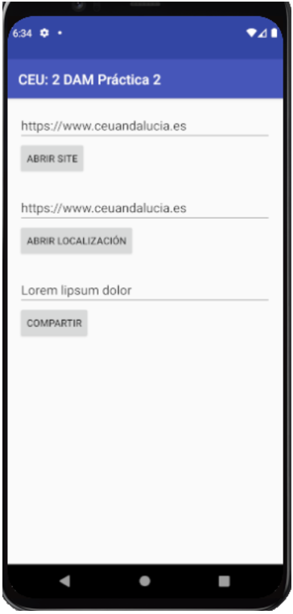

## Entregas

- [Entregas](#entregas)
  - [Contador](#contador)
  - [Intents Implícitos](#intents-implícitos)
    - [Explicaciones](#explicaciones)
    - [Código Usado](#código-usado)

### Contador

<details>
<summary>GUI Requerida</summary>


</details>

- Toast: Se mostrará un mensaje Toast con la cuenta actual.
- Count: Sumara uno a la actual cuenta.
- El sistema debe de recordar el último número en contar. 
- Si es la primera vez empieza en 0.
- Ampliación: 
  - Incluir botón “CERO” para reiniciar la cuenta.
  - El título del activity será: Hello + Nombre

### Intents Implícitos

<details>
<summary>GUI requerida</summary>


</details>


En esta práctica, tenéis que crear una aplicación que envía un intent implícito para realizar cada una de las siguientes tareas:
    • Abrir una URL en un navegador web.
    • Abrir una ubicación en un mapa.
    • Compartir texto.

Compartir (enviar información a otras personas a través del correo electrónico o las redes sociales) es una característica popular en muchas aplicaciones. Para la acción de compartir, usa ShareCompat.IntentBuilder, lo que facilita la creación de una intención implícita para compartir datos.

Como actividad de ampliación podéis crear un receptor con un intent simple que acepta un intent implícito para una acción específica.

#### Explicaciones

1. Creamos Layout con 3 EditText + 3 Button
   1. LinearLayout con orientación vertical
   2. [Extra] Añado un estilo con fuente personalizada
      1. res>new>resourcefile>font
      2. Añado la fuente satisfy.ttf a res>font
      3. Creo un estilo en styles.xml
      ```xml
          <style name="shareText">
            <item name="fontFamily">@font/Satisfy</item>
            <item name="android:textSize">25sp</item>
            <item name="android:textStyle">bold</item>
            <item name="android:gravity">center</item>
          </style>
      ```
      4. Añado el estilo en el EditText
        ```xml
        style="@style/shareText"
        ```
   3. Añado listener en cada botón usando el atributo onClick
    ```xml
      <Button
        android:onClick="shareText"
      />
    ```
   4. Creo variable de clase y referencio el View
   5. Implemento el método referenciado en onClick
   ```java
    public void visitWebSite(View view) {
        String url = mWebSiteEditText.getText().toString(); //Obtengo el String del EditText
        Uri websiteUri = Uri.parse(url); //parseo a URL
        //Creación de Intent Implícito
        Intent intent = new Intent(Intent.ACTION_VIEW //especificamos una acción
                ,websiteUri); //especificamos datos requeridos para la acción

        if(intent.resolveActivity(getPackageManager())!= null){ //nos aseguramos de que haya alguna Activity que pueda resolver nuestro Intent Implicito
            startActivity(intent); //si existe al menos una Activity que pueda manejar el Intent, se lanza
        }else{
            Log.d(TAG, "No hay navegador disponible");
        }
    }
   ```
   6. Implemento el Intent para abir localización en google maps. El Intent tiene la misma acción. Sólo cambia el string que le pasamos en la petición
   ```java
    Uri locUri = Uri.parse( //parseamos la localización
                "geo:0,0?q=" //geo search query
                + location //se añade el texto a la peticón
        );
   ```
   7. Implemento shareText(). Me valgo de la clase ShareCompat.IntentBuilder.
   

#### Código Usado
- Uri: parse()
  - "geo:0,0?q=<localizacion>"
- Intent: new Intent(ACTION,DATA)
  - ACTIONS: Intent.ACTION_VIEW
- ShareCompat.IntentBuilder: from();